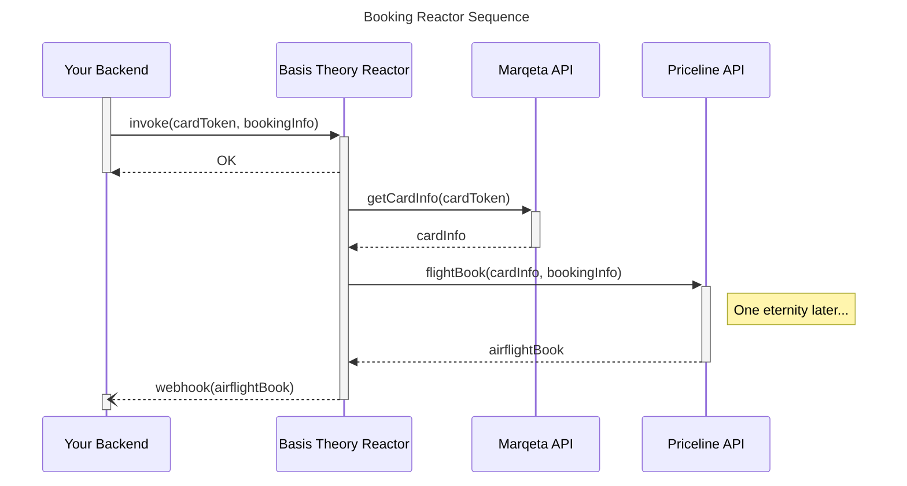

# Priceline Booking Example

This example repository shows how to create the following Basis Theory Resources using Terraform:

1. Reactor to call the Marqeta API for retrieving the card, and pass it to Priceline API
2. Server-side API Key with access to invoke the Reactor



## Terraform

Create a new `terraform.tfvars` file based off `terraform.tfvars.example`, replace the necessary values.

The `bt_management_api_key` should have `application:*` and `reactor:*` permissions. [Click here](https://portal.basistheory.com/applications/create?permissions=application%3Acreate&permissions=application%3Aread&permissions=application%3Aupdate&permissions=application%3Adelete&permissions=reactor%3Acreate&permissions=reactor%3Aread&permissions=reactor%3Aupdate&permissions=reactor%3Adelete&type=management&name=Terraform) to create a new management application using the Portal.

Create resources using:

```shell
terraform apply
```

It should give you two outputs:

```text
backend_application_key = <sensitive>
priceline_reactor_id = "124da2af-afef-45d3-9850-4f017dece05d"
```

## Invoking the Reactor

Using the outputs from the previous step, [invoke](https://developers.basistheory.com/docs/api/reactors/#invoke-a-reactor) the Reactor [**asynchronously**](https://developers.basistheory.com/docs/concepts/what-are-reactors#asynchronous-reactors) using:

```shell
curl -L 'https://api.basistheory.com/reactors/{{priceline_reactor_id}}/react' \
-H 'Content-Type: application/json' \
-H 'Accept: application/json' \
-H 'BT-API-KEY: {{backend_application_key}}' \
--data-raw '{
    "args": {
        "cardToken": "5880854a-0ed8-4943-9488-389bd7b4a6b8",
        "bookRequest": {
            "sid": "a1b2c3d4e5f6g7h8i9j10k11l12m13n14o15p16q17r18s19t20u21v22w23x24y25z26",
            "ppn_bundle": "HEC_1A2B3C4D...",
            "passenger[0][name_prefix]": "Mr.",
            "passenger[0][first_name]": "Mr.",
            "passenger[0][last_name]": "Mr.",
            "passenger[0][gender]": "M",
            "passenger[0][birthday]": "1960-01-01",
            "phone_number": "1234567891",
            "email": "test.email@domain.com",
            "address": "123 Banatyne Ave",
            "city": "Winnipeg",
            "state_code": "MB",
            "country_code": "CA",
            "postal_code": "R3E2H2",
            "cc_name": "HotelsbycityOperations",
            "cc_type": "VI",
        }
    }
    "callback_url": "https://abc5k4asdf15xpt.m.pipedream.net",
    "timeout_ms": 60000
}'
```

> 💡 Don't forget to replace `880854a-0ed8-4943-9488-389bd7b4a6b8` with the Marqeta's card token, and `callback_url` with your webhook API endpoint.

## CLI

You can connect to Reactor's console logs using [Basis Theory CLI](https://www.npmjs.com/package/@basis-theory-labs/cli).

```shell
bt reactors logs $priceline_reactor_id -x $bt_management_api_key
```

> ⚠️ When deploying changes using Terraform, it is necessary to reconnect to the Reactor
